import CaseSection from '@/components/CaseSection.astro'
import Carousel from '@/components/Carousel.astro'
import FigmaPrototype from '@/components/FigmaPrototype.astro'

<CaseSection title='Context'>

#### Design Thinking

We use design thinking to deeply understand user needs, generate innovative solutions, and iterate quickly to create meaningful and *user-centered experiences*. This approach promotes creativity, empathy, and collaboration, eventually leading to the development of impactful solutions that address *real user challenges*.

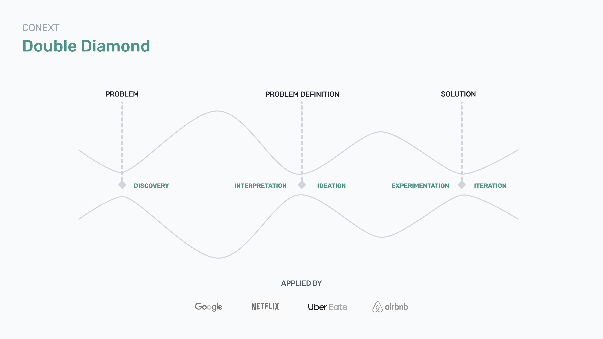

#### Nowadays

We find ourselves in a situation where, due to the *pandemic*, the *number of pets* in households has *increased* (44% for dogs, 35% for cats\*). This has opened up a range of opportunities in the pet sector, allowing us to explore and propose solutions to the needs faced by these pet owners.

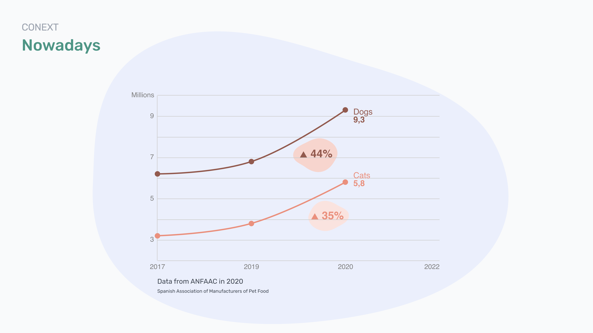

<small>\*Data from ANFAAC 2020 (Spanish Association of Manufacturers of Pet Food).</small>

</CaseSection>

<CaseSection title='Research'>

#### Discovery

The aim was to gather vital information about *dog and cat owners*, enabling the identification of their needs, behaviours, and frustrations. This effort was geared towards understanding them, discerning patterns in their behaviour, and identifying opportunities for improvement.

#### Archetype

We did some outreach interviews to identify potential DataPet users and to empathise with them, avoiding biases from our perspective. Therefore, We identified the archetype for DataPet *"the caregiver"*, individuals committed to their pet's health and dedicated to positively transforming it. Additionally, we recognised the importance of including health professionals, particularly *veterinarians*, although they are not the primary users of the platform.

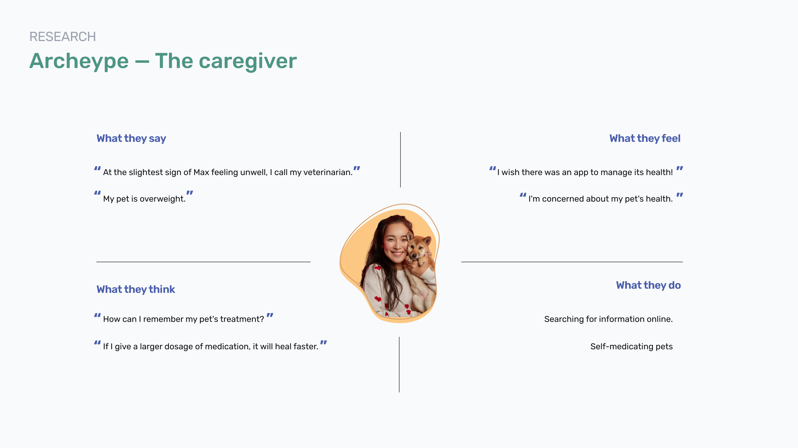

#### Surveys and Interviews

We collected responses from caregivers through *81 surveys* and *15 interviews*, and from veterinarians through *7 interviews*. These insights emerged from the data:

From caregivers:

- *97%* want to manage their *pet's health digitally*.
- *75% forgets* or are uncertain about the *treatments* to administer.
- 45% don't keep their pets' habits up to date.

From veterinarians:

- *87%* assert that if owners had an *app to manage health*, they would save additional work.
- 35% Say that owners forget to bring the veterinary record to the appointment.

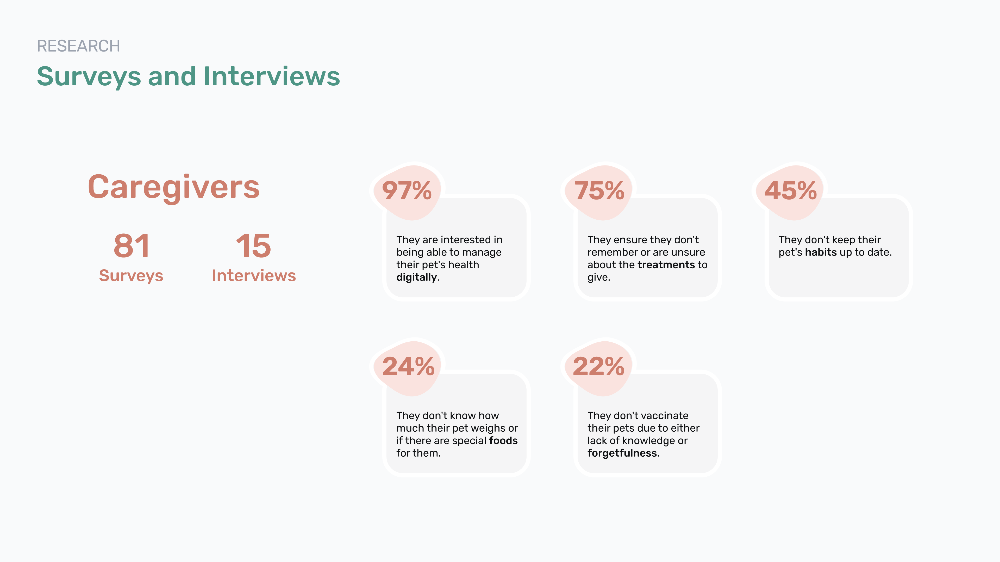
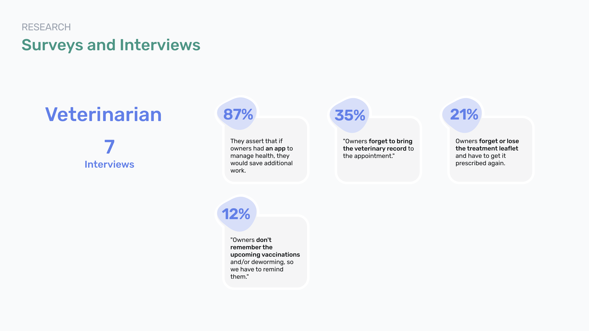

</CaseSection>

<CaseSection title='Business'>

#### Benchmark

Through a market study, we were able to identify where existing applications stood and determine where we wanted to position ourselves against the competition. We aimed to offer an app with a *better UX/UI and offer more features*. Because most of them weren’t intuitive and had few features to solve specific user needs.

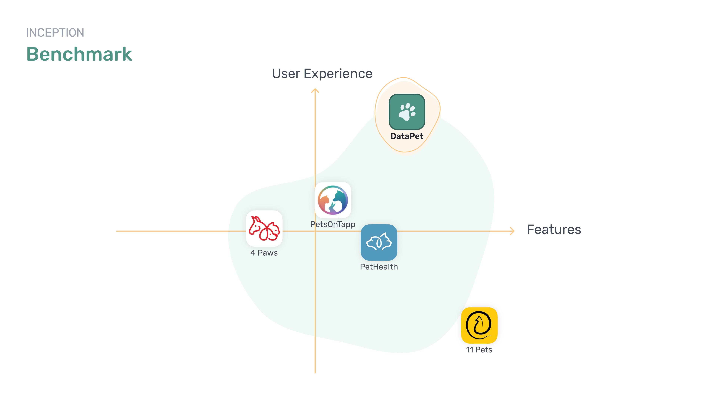

#### Business Model Canvas

A business model canvas provides a concise overview of our business strategy, including our value proposition, target market, revenue streams, and key partnerships. It helps us communicate our model clearly, identify opportunities for improvement, and align our team around common goals. We identified as *key partners* the *veterinary database* software. As *revenue streams* to ensure the sustainability of the app, DataPet would offer a free plan with basic features and a *monthly or annual subscription*, providing additional valuable functionalities for users.

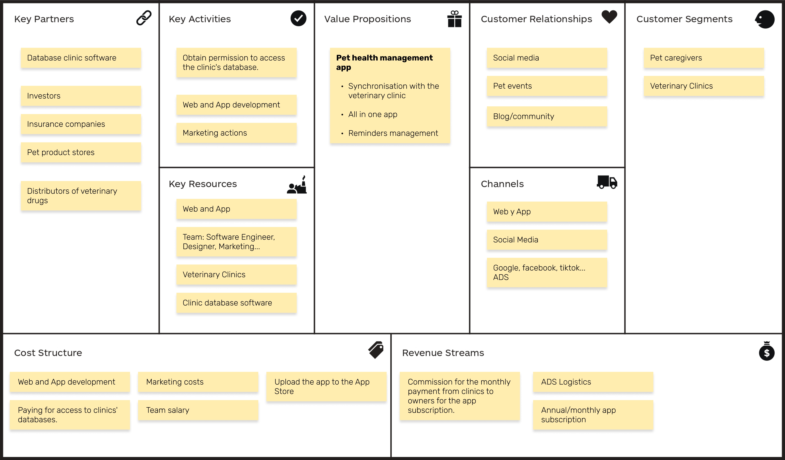

</CaseSection>

<CaseSection title='App Design'>

#### Focus Group

Focus groups allowed us to gather valuable insights from our users, ensuring that our app suits their needs.

#### MVP

With the feedback obtained from users we decided to add *6 features* for the first version:

- Agenda
- Digital Veterinary Card
- Medical History
- Weight management
- Veterinary 24h
- Calendar synchronisation

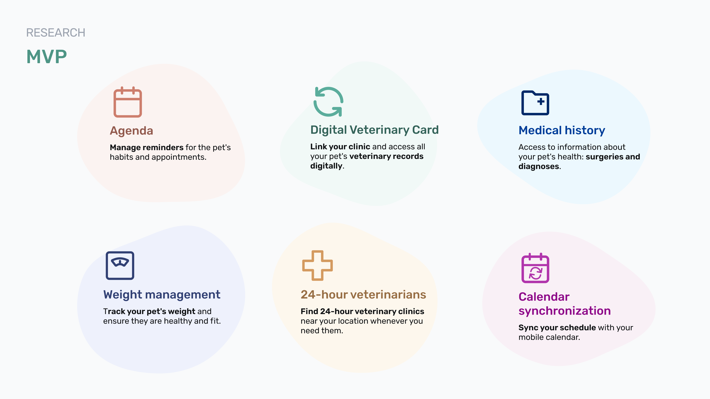

#### Agile

We'll apply agile over *2 sprints of 3 weeks*, adding value at every stage with an iterative, adaptive approach.

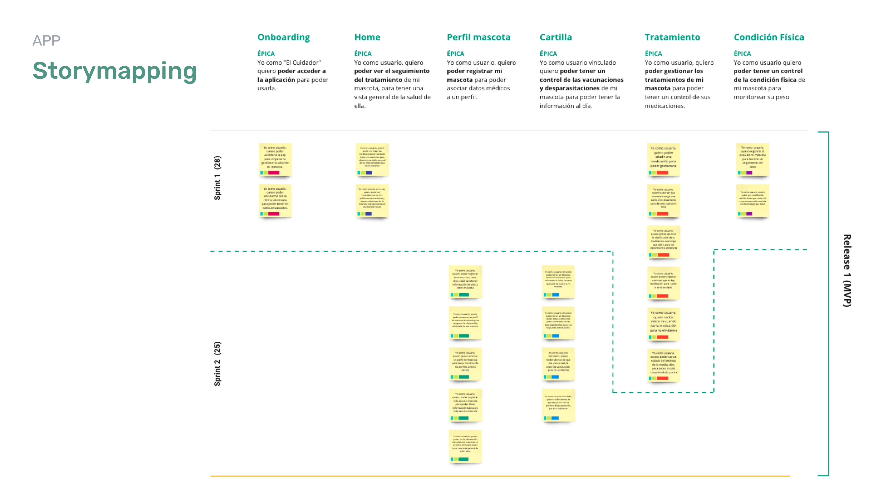

#### Design Concept

For the design concept we want to reflect DataPet's personality and values. We portray ourselves as *familiar*, *approachable*, and *professional*.

<Carousel />

#### Landing

To introduce ourselves, we'd launch a Landing Page where we outline the benefits of DataPet. Finally, we provide an information box on the status and evolution of DataPet, inviting users or interested individuals to collaborate altruistically by *sending us an email*. Additionally, to generate interest, we have a *blog* with news, curiosities, and tips about pets.

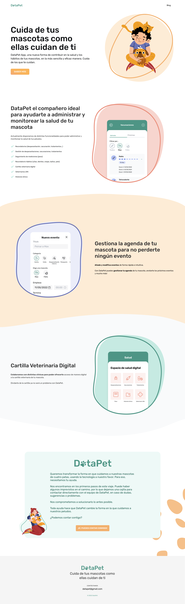

#### Information Architecture & Card Sorting

We structured the information architecture to ensure intuitive navigation and organisation of our platform's content. Then we tested it with users by doing a card sorting session.

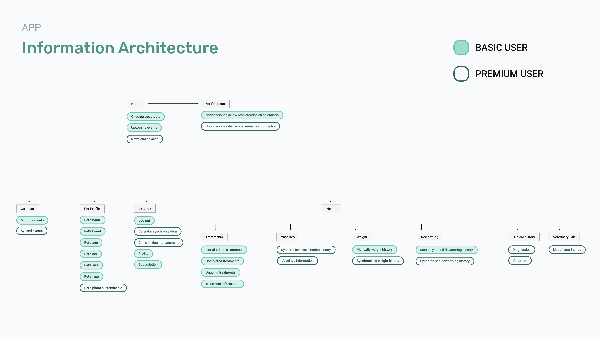
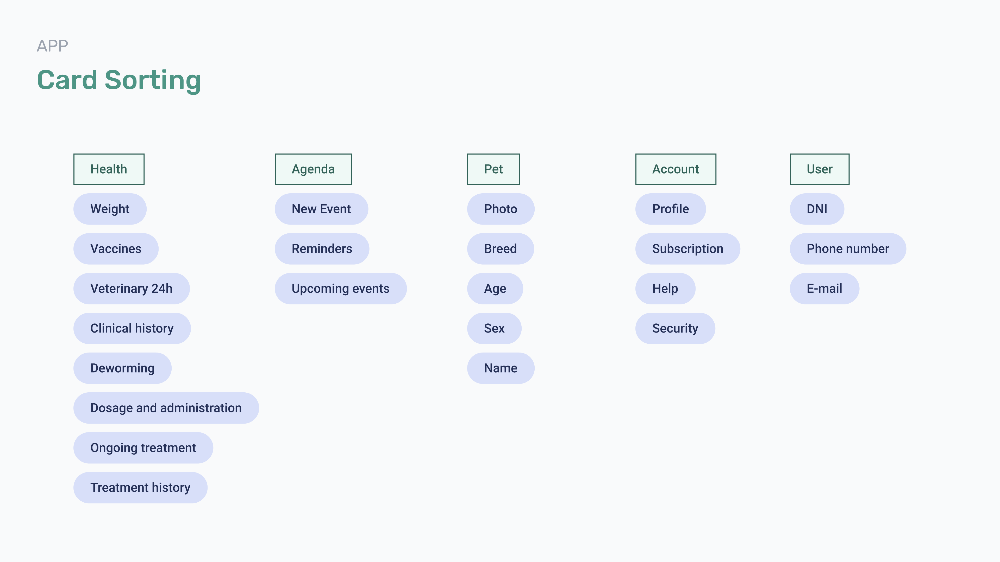

#### Wireframes

We organised the content within wireframes. These allowed us to conduct initial user tests and receive usability feedback. We iterated until reaching the desired result.

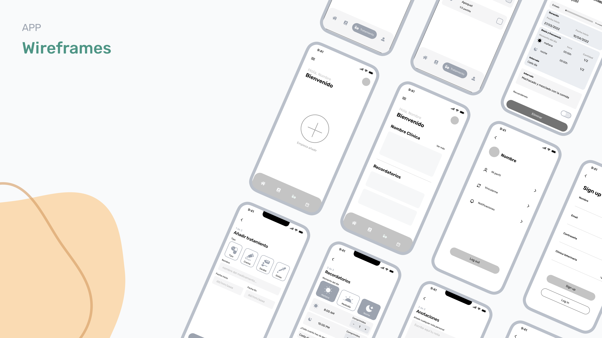

#### Design System

We develop a design system to establish *consistency* and coherence across our platform. This system helps us to focus on design decisions instead of UI components, also facilitates *collaboration* among team members, and enhances *brand recognition* and trust among users.

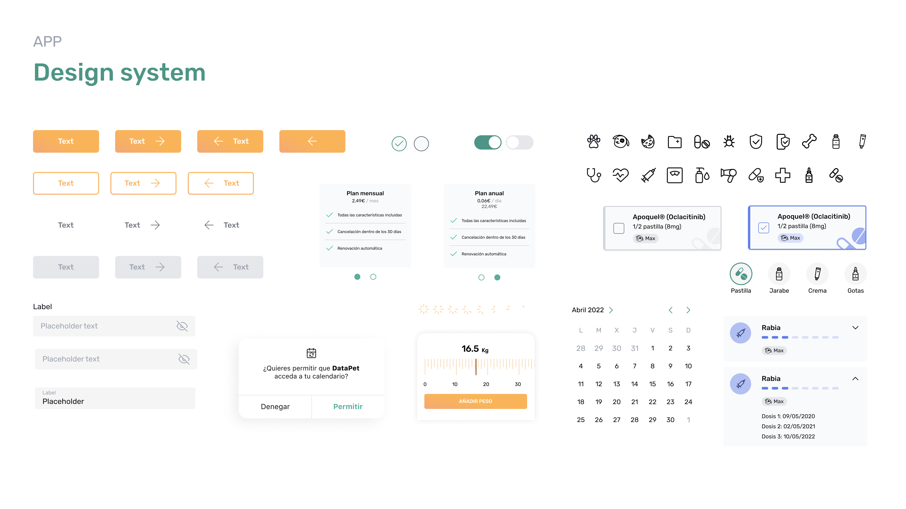

</CaseSection>

<CaseSection title='Result'>

#### Prototype

<FigmaPrototype
	label='Play the prototype 📱'
	breakpoint='lg'
	embedUrl='https://www.figma.com/embed?embed_host=share&url=https%3A%2F%2Fwww.figma.com%2Fproto%2FxbRXFemoG1GASQHH4b6YDz%2FDataPet-%25E2%2580%2594-TFM--Personal%3Fpage-id%3D1327%253A38400%26type%3Ddesign%26node-id%3D1366-46370%26viewport%3D123%252C935%252C0.02%26t%3DLTR9y8IrO7pi36Hs-1%26scaling%3Dcontain%26starting-point-node-id%3D1366%253A47379%3D1%26mode%3Ddesign%26hide-ui%3D1'
	url='https://www.figma.com/proto/xbRXFemoG1GASQHH4b6YDz/DataPet-%E2%80%94-TFM--Personal?page-id=1327%3A38400&type=design&node-id=1366-46370&viewport=171%2C1080%2C0.03&t=YySKm29PDAMhtmJl-1&scaling=scale-down&starting-point-node-id=1366%3A47379&mode=design'
/>

#### Next Steps

- Continue testing and validating design hypotheses.
- Refine the prototyping and design to make it visually appealing and inviting to use, aiming to attract fans rather than just users.
- Explore further into inbound marketing, finding partners and seeking funding opportunities.

</CaseSection>
