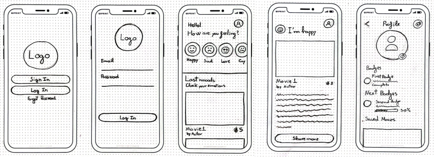
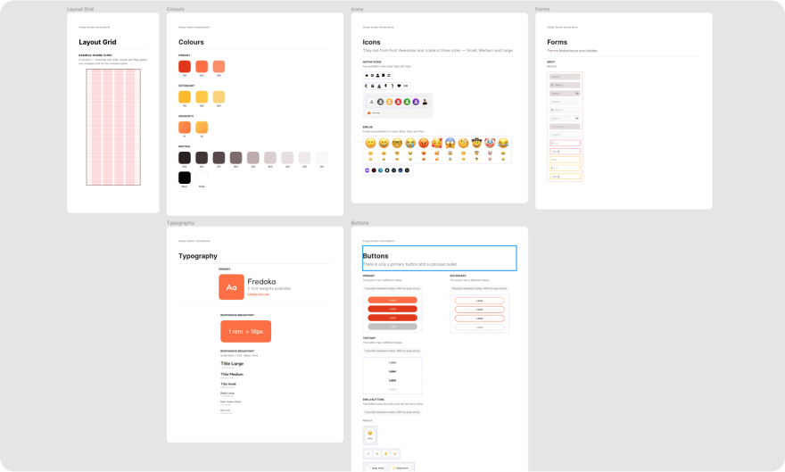

import FigmaPrototype from '@/components/FigmaPrototype.astro'

### ✍️ The challenge: Design an App

The aim of this project was to design an app that matches your mood with a movie. The app should have all the flows prototyped as well as all the animations and micro-interactions.

### 🏗 Wireframes

Instead of wasting time being lost designing in Figma I made some simple drawings of how might be the app (welcome, home, profile, movie view...). This helped me to improve the decision making because I could start sharing the design and receive feedback faster.

### 🗂 Design System

Usually an app solves a problem or maybe more than one. In this case I'm solving one, but maybe in the future, I will add more features in order to solve more problems. Plus, maybe I'm not the designer who will design this new feature. In order to have consistency in all the digital product we must group all the design decisions into a design system. Usually are based on atomic design (atoms, molecules, organisms...), this one is not an exception.

### 📱 Prototype: UI Interactions

Prototype is a good tool for testing and communicate with the team. Approaching as close to reality as possible with a prototype can avoid future misunderstandings with developers and other members of the team. Another important value of designing high fidelity mockups is testing them with real users and save time instead of coding all the app.

<FigmaPrototype
	label='Play the prototype 📱'
	height={704}
	embedUrl='https://www.figma.com/embed?embed_host=share&url=https%3A%2F%2Fwww.figma.com%2Fproto%2FSR7LaqdnAjkv3mlYIy15sP%2FBAU-Experience-Design---Rub%25C3%25A9n-Castillo%3Fpage-id%3D655%253A2104%26node-id%3D879%253A2477%26viewport%3D328%252C48%252C0.08%26scaling%3Dscale-down%26starting-point-node-id%3D879%253A2477%26hide-ui%3D1'
	url='https://www.figma.com/proto/SR7LaqdnAjkv3mlYIy15sP/BAU-Experience-Design---Rub%C3%A9n-Castillo?page-id=655%3A2104&node-id=879%3A2477&viewport=328%2C48%2C0.08&scaling=scale-down&starting-point-node-id=879%3A2477'
/>
