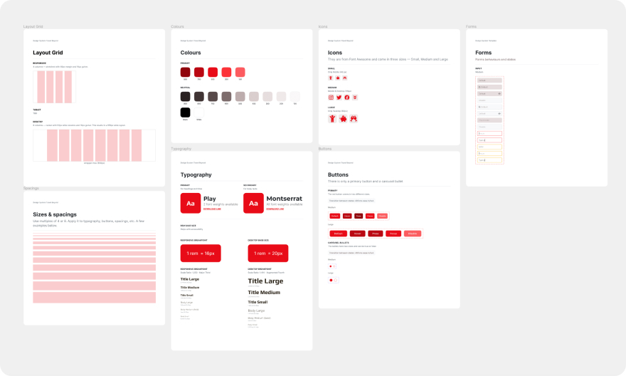

import FigmaPrototype from '@/components/FigmaPrototype.astro'

### ✍️ From content to design

Content defines design. The aim of this project was to design the UI of a landing page departing from the content. Usually designers fall in the temptation to use Lorem ipsum default texts. This ends up making wrong design decisions. All the structure of this project was made based on the content.

### 🗂 “Mini” Design System

To be honest, a landing page doesn't need a design system. But I really wanted to design it because I had the desire to start in this world of grouping components like if were going to start a lego project, that's why I name it “mini”.

### 📱 Mobile First & Responsive

Sometimes when we make a desktop UI we end up making impossible designs for smaller devices. This project was developed first in mobile to prevent future headaches trying to fit all the nice and lovely content from desktop into mobile.

<FigmaPrototype
	label='Play mobile prototype 📱'
	embedUrl='https://www.figma.com/embed?embed_host=share&url=https%3A%2F%2Fwww.figma.com%2Fproto%2FqKxGGY1aLSOsjrfx9smiKx%2FTravel-Beyond%3Fpage-id%3D42%253A99%26node-id%3D42%253A99%26viewport%3D328%252C48%252C0.42%26scaling%3Dcontain%26starting-point-node-id%3D42%253A101%26hide-ui%3D1'
	url='https://www.figma.com/proto/qKxGGY1aLSOsjrfx9smiKx/Travel-Beyond?page-id=2%3A3&node-id=3%3A126&viewport=359%2C48%2C0.12&scaling=min-zoom&starting-point-node-id=3%3A126&show-proto-sidebar=1'
/>

### 🖥 Desktop Prototype

Desktop designs can be more shocking in terms of user experience. Taking in mind the content displayed in mobile I decided to add an interaction of scrolling down with full screen of each section.

<FigmaPrototype
	label='Play desktop prototype 🖥'
	height={704}
	embedUrl='https://www.figma.com/embed?embed_host=share&url=https%3A%2F%2Fwww.figma.com%2Fproto%2FqKxGGY1aLSOsjrfx9smiKx%2FTravel-Beyond%3Fpage-id%3D42%253A100%26node-id%3D42%253A337%26viewport%3D328%252C48%252C0.11%26scaling%3Dcontain%26starting-point-node-id%3D42%253A337%26hide-ui%3D1'
	url='https://www.figma.com/proto/qKxGGY1aLSOsjrfx9smiKx/Travel-Beyond?page-id=2%3A3&node-id=3%3A126&viewport=359%2C48%2C0.12&scaling=min-zoom&starting-point-node-id=3%3A126&show-proto-sidebar=1'
/>
